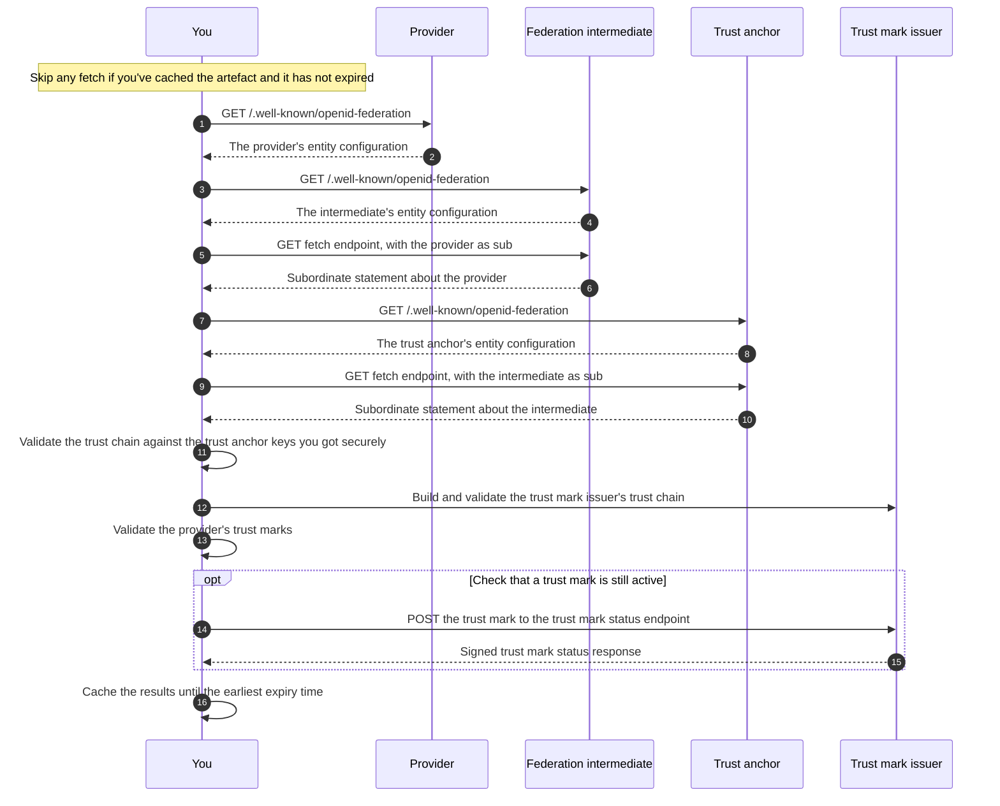
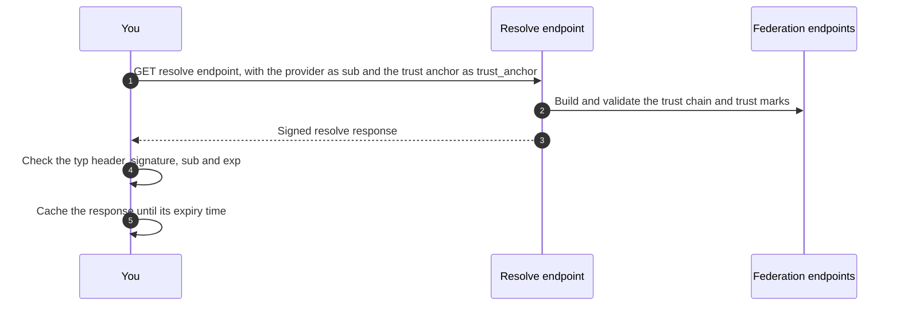

> [!CAUTION]
> **Work in progress**
>
> This documentation is a work in progress and is subject to change.

# Check another provider's certification

This page is for DVS providers. If you're a UK public authority, read the [information for public authorities](public-authorities.md) first.

You can use the DVS register machine-readable infrastructure to check what another DVS provider is certified to do.

The  machine-readable infrastructure is designed so that you can check signed artefacts once and cache them locally for a period of time. You do not need to make a live look up the register every time you check a provider.

## How it works

## Before you start

You do not need to authenticate to check another provider's certification. The federation's endpoints are open, which is the default in [OpenID Federation 1.1](https://openid.net/specs/openid-federation-1_1.html).

Before you check another provider's certification, you need to get the OfDIA trust anchor's entity identifier and public keys.

OpenID Federation 1.1 expects you to get the trust anchor's public keys in a secure way that does not rely on the federation itself.

> [!NOTE]
> **Information to follow**
>
> We'll publish:
>
> - the OfDIA trust anchor's entity identifier
> - how to get the trust anchor's public keys securely

## Find a provider's entity identifier

The federation intermediate's list endpoint (`federation_list_endpoint`) returns the entity identifiers of all the DVS providers in the federation. You'll find the list endpoint's location in the intermediate's entity configuration.

The list is not signed. Build and validate a trust chain for a provider before you rely on anything about it.

> [!NOTE]
> **Information to follow**
>
> We'll publish:
>
> - how you'll match a DVS provider's entry on the register of digital identity and attribute services to its entity identifier
> - whether the list endpoint will support filtering by trust mark type

## Build the trust chain

To check a provider, you should build a trust chain from the provider's entity configuration to the OfDIA trust anchor, then validate it. This confirms that the provider is part of the federation.

To build the trust chain:

1. Fetch the provider's entity configuration from its entity identifier followed by `/.well-known/openid-federation`.
2. Use the `authority_hints` claim in the provider's entity configuration to find the federation intermediate, and fetch the intermediate's entity configuration.
3. Fetch the subordinate statement about the provider from the intermediate's `federation_fetch_endpoint`, with the provider's entity identifier as the `sub` parameter.
4. Repeat steps 2 and 3 for the intermediate. This gets you the OfDIA trust anchor's entity configuration and the trust anchor's subordinate statement about the intermediate.

## Validate the trust chain

To validate the trust chain, you must check that:

1. Each statement has its `typ` header set to `entity-statement+jwt`, an `alg` header that is not `none`, and a `kid` header.
2. Each statement contains all the required claims, its issued at time (`iat`) is in the past and its expiry time (`exp`) is in the future.
3. The provider's entity configuration has the same `iss` and `sub`, and is signed by a key in its own `jwks` claim.
4. Each statement's `iss` matches the `sub` of the next statement in the chain.
5. Each statement, apart from the trust anchor's entity configuration, is signed by a key published in the `jwks` claim of the next statement in the chain.
6. The chain ends with the OfDIA trust anchor's entity configuration, and that entity configuration is signed with the trust anchor keys you got securely.

You must then apply any metadata, metadata policies and constraints in the subordinate statements, to get the provider's resolved metadata. See [section 6 of OpenID Federation 1.1](https://openid.net/specs/openid-federation-1_1.html#name-federation-policy).

This is a summary. Follow [section 10 of OpenID Federation 1.1](https://openid.net/specs/openid-federation-1_1.html#name-resolving-the-trust-chain-a) in full, or use a library that implements it.

> [!NOTE]
> **Information to follow**
>
> We'll confirm whether the federation intermediate will set metadata, metadata policies or constraints in its subordinate statements.

## Validate the provider's trust marks

When you have a valid trust chain for the provider, you must validate each trust mark in the provider's entity configuration before you rely on it, as described in [section 7.3 of OpenID Federation 1.1](https://openid.net/specs/openid-federation-1_1.html#name-validating-a-trust-mark).

Before you validate the trust marks, you must build and validate a trust chain for OfDIA's trust mark issuer, in the same way. This gives you the keys the trust mark issuer signs trust marks with.

You should also check that the OfDIA trust anchor's entity configuration lists OfDIA's trust mark issuer in its `trust_mark_issuers` claim for each trust mark type.

For each trust mark, you must check that:

- its `typ` header is `trust-mark+jwt` and its `alg` header is not `none`
- it's signed by OfDIA's trust mark issuer, with the key identified by its `kid` header
- the `sub` claim matches the provider's entity identifier
- the `trust_mark_type` claim matches the `trust_mark_type` next to it in the entity configuration
- its issued at time (`iat`) is in the past
- it has not expired, if it has an expiry time (`exp`)

You should then check that the provider's trust marks cover the certification you need. For example, if you need a provider certified against a particular supplementary code, check that the provider has a trust mark for that supplementary code.

You can also use OfDIA's [trust mark status endpoint](trust-marks.md#check-the-status-of-a-trust-mark) to check whether a trust mark is still active.

## Cache what you've checked

You should cache the artefacts you've checked, rather than fetching and validating them for every check. These include:

- entity configurations
- subordinate statements
- trust chains
- trust marks

You must not use a cached artefact after it expires. A trust chain expires at the earliest expiry time (`exp`) of the statements in it, as described in [section 10.4 of OpenID Federation 1.1](https://openid.net/specs/openid-federation-1_1.html#name-calculating-the-expiration-). You should refresh your cache before the artefacts in it expire.

If a provider's certification changes, the artefacts that describe it will change. The shorter the time you cache for, the sooner you'll see the change.

> [!NOTE]
> **Information to follow**
>
> We'll publish:
>
> - recommended cache durations for each artefact
> - how long each artefact will be valid for
> - how quickly a change to a provider's certification will be reflected in the artefacts

## Use the resolve endpoint

The machine-readable infrastructure also provides a resolve endpoint, as described in [section 8.3 of OpenID Federation 1.1](https://openid.net/specs/openid-federation-1_1.html#name-resolve-entity).

The resolve endpoint returns a signed response containing a provider's resolved metadata, its trust marks and the trust chain the resolver used. You can use it instead of building and validating the trust chain yourself. If you do, you're trusting the resolver to validate the trust chain and trust marks correctly.

When you call the resolve endpoint, send the provider's entity identifier as the `sub` parameter and the OfDIA trust anchor's entity identifier as the `trust_anchor` parameter.

Before you rely on a resolve response, you must check that:

- its `typ` header is `resolve-response+jwt`
- it's signed by the resolver, with the key identified by its `kid` header
- the `sub` claim matches the provider's entity identifier
- it has not expired

You should cache the response from the resolve endpoint, rather than calling it for every check. You must not use it after its expiry time (`exp`). This is the earliest expiry time of the trust chain and trust marks it's based on.

> [!NOTE]
> **Information to follow**
>
> We'll publish:
>
> - the location of the resolve endpoint
> - which entity signs resolve responses, and how to get its keys

## Verify credentials presented in person

To check the issuer of a credential presented in person, including offline, you should use the VICAL. If you provide a wallet, you should use the RICAL to check readers that request credentials from your users.

Find out how to [use the VICAL and RICAL](vical-and-rical.md#use-the-vical-and-rical).

<!-- pagination:start -->

---

- Previous: [Onboard to the VICAL and RICAL](vical-and-rical.md)
- Next: [Information for public authorities](public-authorities.md)
<!-- pagination:end -->
