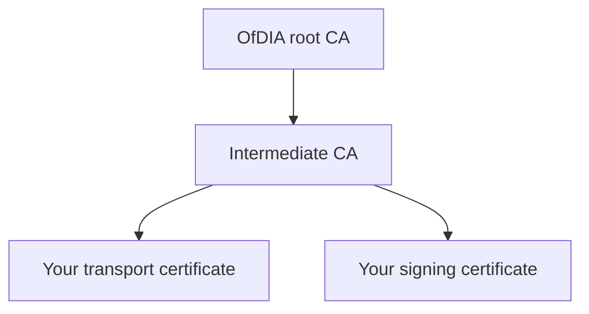
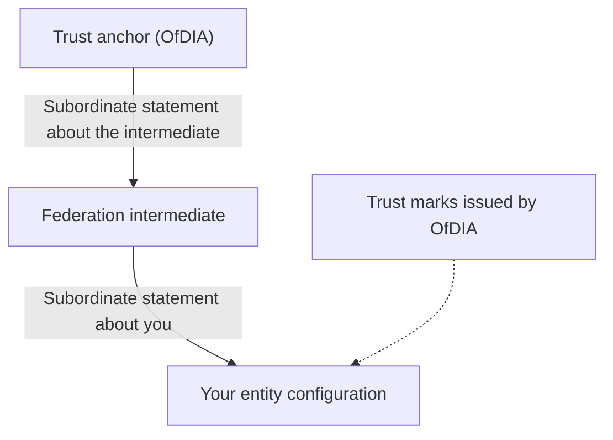

> [!CAUTION]
> **Work in progress**
>
> This documentation is a work in progress and is subject to change.

# How trust works in the DVS register machine-readable infrastructure

The DVS register machine-readable infrastructure uses 3 parts to establish trust between participants:

- [a private public key infrastructure (PKI)](#authenticate-with-the-private-pki), which confirms who you are when you use the register's APIs
- [an OpenID Federation](#share-your-certification-through-the-federation), which confirms what a DVS provider is certified to do
- [a VICAL and a RICAL](#verify-credentials-offline-with-the-vical-and-rical), which support checks when a credential is presented in person, including offline

OfDIA operates the root CA, is the federation's trust anchor and plans to publish the VICAL and RICAL.

## Authenticate with the private PKI

OfDIA operates a root certificate authority (CA). The root CA issues a certificate to an intermediate CA, which issues certificates to participants through the provider portal.

You'll get 2 certificates through the portal:

- a transport certificate
- a signing certificate

You'll use these certificates to authenticate when you use the machine-readable infrastructure APIs. You can choose to authenticate using either mutual TLS (mTLS) or `private_key_jwt`.

You do not need these certificates to check another DVS provider's certification. The federation's endpoints are open, so anyone can use them without authenticating.

Find out how to [get your certificates](get-your-certificates.md).

## Share your certification through the federation

The machine-readable infrastructure uses [OpenID Federation 1.1](https://openid.net/specs/openid-federation-1_1.html) to let DVS providers share the scope of their certification with other DVS providers and with public authorities.

In the federation:

- OfDIA is the trust anchor
- a federation intermediate, which is part of the machine-readable DVS register, issues subordinate statements about DVS providers
- each DVS provider publishes an entity configuration on a well-known endpoint that it hosts
- OfDIA issues a trust mark for each part of a DVS provider's certification, such as its role, each identity profile and each supplementary code

When another participant wants to check your certification, they build a trust chain from your entity configuration, through the federation intermediate, to the OfDIA trust anchor. They then check the trust marks in your entity configuration.

Find out how to:

- [join the federation](join-the-federation.md)
- [use trust marks](trust-marks.md)
- [check another provider's certification](check-another-provider.md)

## Verify credentials offline with the VICAL and RICAL

We plan to publish a verified issuer certificate authority list (VICAL) and a reader identity certificate authority list (RICAL). These are signed lists of trusted CA certificates:

- the VICAL lists the CAs of issuers of credentials, so a reader can check who issued a credential
- the RICAL lists the CAs of readers, which request credentials from a holder, so a holder's wallet can check the reader

Both lists are for credentials in the mdoc format defined in ISO/IEC 18013-5. They support checks when these credentials are presented in person (proximity presentation), including when there's no internet connection at the time of presentation.

Find out how to [onboard to the VICAL and RICAL](vical-and-rical.md).

## Cache what the register publishes

The machine-readable infrastructure and the DVS providers in the federation publish signed artefacts that you can check once and cache. These include:

- entity configurations, which each participant publishes about itself
- subordinate statements, which the federation intermediate and the OfDIA trust anchor publish
- trust marks, which OfDIA issues and DVS providers include in their entity configurations
- the VICAL and RICAL, which OfDIA plans to publish

This means you do not need to look up the register each time you check a provider.

The register also provides a resolve endpoint. You should cache what you get from it until it expires, rather than calling it for every check.

> [!NOTE]
> **Information to follow**
>
> We'll publish recommended cache durations and the validity periods of each artefact.

Find out how to [check another provider's certification](check-another-provider.md).

<!-- pagination:start -->

---

- Previous: [Overview](../README.md)
- Next: [Get your certificates](get-your-certificates.md)
<!-- pagination:end -->
