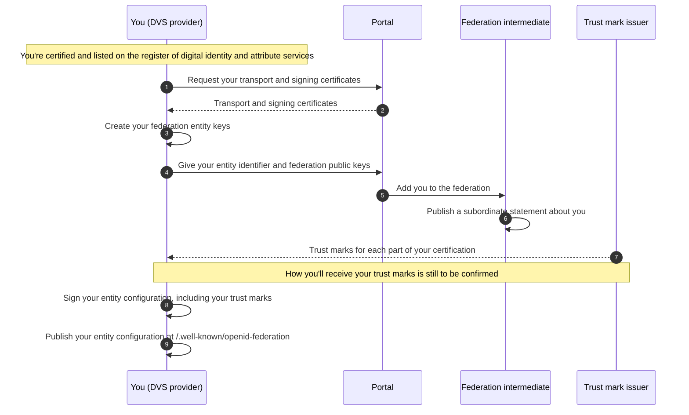

> [!CAUTION]
> **Work in progress**
>
> This documentation is a work in progress and is subject to change.

# Join the federation

To share the scope of your certification, you should join the DVS register's federation. The federation uses [OpenID Federation 1.1](https://openid.net/specs/openid-federation-1_1.html).

When you join the federation:

- you publish an entity configuration about yourself on a well-known endpoint that you host
- the federation intermediate publishes a subordinate statement about you
- other participants can build a trust chain from your entity configuration to the OfDIA trust anchor

## How it works




## Before you start

Before you join the federation, you should:

- be a certified DVS provider on the [DVS register](https://www.access-dvs-register.service.gov.uk/)
- have access to the provider portal
- be able to host an HTTPS endpoint on a domain you control

## Choose your entity identifier

Your entity identifier is a URL that identifies you in the federation. Other participants use it to find your entity configuration.

In OpenID Federation 1.1, an entity identifier:

- uses the `https` scheme
- has a host
- can include a port and a path
- does not include a query or a fragment

For example, `https://dvs-provider.example.com`.

You should choose an entity identifier you expect to keep, because other participants will use it to identify you.

> [!NOTE]
> **Information to follow**
>
> We'll confirm whether you should have one entity identifier for your organisation, or one for each of your registered services.

## Create your federation entity keys

You sign your entity configuration with your federation entity keys. You generate and manage these keys yourself.

Your federation entity keys are separate from the [certificates you get through the portal](get-your-certificates.md). You should not use your federation entity keys for anything other than the federation.

You publish your federation public keys in the `jwks` claim of your entity configuration. The subordinate statement that the federation intermediate publishes about you also contains your federation public keys.

Each key must have a unique key ID (`kid`). OpenID Federation 1.1 recommends that you use the SHA-256 [JSON Web Key (JWK) thumbprint](https://www.rfc-editor.org/rfc/rfc7638) of the key as its key ID.

You should keep your federation private keys secure. Anyone with access to them could publish statements about you.

> [!NOTE]
> **Information to follow**
>
> We'll confirm which key types and signing algorithms the federation supports.

## Onboard to the federation

You'll onboard to the federation through the portal.

The federation intermediate needs your entity identifier and your federation public keys so it can publish a subordinate statement about you.

> [!NOTE]
> **Information to follow**
>
> We'll publish how to onboard to the federation, including what information you'll need to provide in the portal.

## Publish your entity configuration

Your entity configuration is a signed JWT that describes you. It contains your federation public keys, your metadata and your trust marks.

Host your entity configuration at your entity identifier followed by `/.well-known/openid-federation`. If your entity identifier ends with a `/`, remove it before you add `/.well-known/openid-federation`. For example:

```text
https://dvs-provider.example.com/.well-known/openid-federation
```

Return your entity configuration with the content type `application/entity-statement+jwt`.

Other participants and the machine-readable DVS register will fetch your entity configuration from this endpoint, so it should be reliably available.

### Set the JWT header

Your entity configuration's JWT header must include:

| Header parameter | Value |
| --- | --- |
| `typ` | `entity-statement+jwt` |
| `alg` | The algorithm you used to sign the entity configuration – this must not be `none` |
| `kid` | The key ID of the federation entity key you used to sign the entity configuration |

OpenID Federation 1.1 says that participants reject entity statements that do not have `typ` set to `entity-statement+jwt`, or whose `kid` does not match a key in the issuer's `jwks` claim.

### Add the claims

Your entity configuration must include these claims.

| Claim | Value |
| --- | --- |
| `iss` | Your entity identifier |
| `sub` | Your entity identifier – the same as `iss` |
| `iat` | The time you issued the entity configuration, as a number of seconds since the Unix epoch |
| `exp` | The time the entity configuration expires, as a number of seconds since the Unix epoch |
| `jwks` | A JSON Web Key Set (JWKS) containing your federation public keys |
| `authority_hints` | An array containing the entity identifier of the federation intermediate – it must not be empty |
| `metadata` | Metadata about you, grouped by entity type – it must contain an entry for each entity type you use, even if that entry is an empty object (`{}`) |

You should also include the `trust_marks` claim, containing the [trust marks](trust-marks.md) that OfDIA has issued to you. Other participants use your trust marks to check what you're certified to do.

> [!NOTE]
> **Information to follow**
>
> We'll confirm:
>
> - the entity identifier of the federation intermediate
> - which entity types and metadata you should include in `metadata`
> - how long your entity configuration should be valid for, which sets the gap between `iat` and `exp`

### Example entity configuration

This example shows the JWT header and claims of an entity configuration before it's signed. Replace the values in square brackets.

The `iat` and `exp` values are examples. They must be numbers, not strings. Each key in `jwks` is a JSON Web Key (JWK) object. The public key parameters it contains depend on the key type.

JWT header:

```json
{
  "typ": "entity-statement+jwt",
  "alg": "[SIGNING ALGORITHM]",
  "kid": "[KEY ID]"
}
```

JWT claims:

```json
{
  "iss": "https://dvs-provider.example.com",
  "sub": "https://dvs-provider.example.com",
  "iat": 1790000000,
  "exp": 1790086400,
  "jwks": {
    "keys": [
      {
        "kty": "[KEY TYPE]",
        "kid": "[KEY ID]",
        "[PUBLIC KEY PARAMETER]": "[VALUE]"
      }
    ]
  },
  "authority_hints": [
    "[INTERMEDIATE ENTITY IDENTIFIER]"
  ],
  "metadata": {
    "federation_entity": {
      "organization_name": "Example DVS Provider Ltd"
    }
  },
  "trust_marks": [
    {
      "trust_mark_type": "[TRUST MARK TYPE IDENTIFIER]",
      "trust_mark": "[SIGNED TRUST MARK JWT ISSUED BY OFDIA]"
    }
  ]
}
```

## Keep your entity configuration up to date

You should publish a new, signed entity configuration:

- before your current entity configuration expires
- when OfDIA issues you a new trust mark, or a trust mark expires or is revoked
- when you rotate your federation entity keys (see below)

## Rotate your federation entity keys

When other participants validate your entity configuration, they check its signature against the keys in the subordinate statement that the federation intermediate publishes about you, as well as the keys in your own `jwks` claim. This is described in [section 10.2 of OpenID Federation 1.1](https://openid.net/specs/openid-federation-1_1.html#name-validating-a-trust-chain).

This means the federation intermediate must publish your new public key before you start signing with it. If you sign with a new key too early, other participants will not be able to validate your trust chain.

To rotate your federation entity keys:

1. Generate a new key pair and give the new public key to the federation intermediate.
2. Wait until the federation intermediate publishes a subordinate statement about you that contains both your old and new public keys.
3. Wait until any earlier subordinate statement about you, which only contains your old key, has expired. Other participants may have cached it until its expiry time (`exp`).
4. Publish a new entity configuration that contains both keys in its `jwks` claim, signed with your new key.
5. After the last entity configuration you signed with your old key has expired, remove the old key from your `jwks` claim and ask the federation intermediate to remove it too.

> [!NOTE]
> **Information to follow**
>
> We'll publish:
>
> - how to update the federation public keys that the federation intermediate holds for you when you rotate your keys
> - what to do if you think one of your federation private keys has been compromised

## Next steps

- [Understand trust marks](trust-marks.md)
- [Check another provider's certification](check-another-provider.md)

<!-- pagination:start -->

---

- Previous: [Get your certificates](get-your-certificates.md)
- Next: [Understand trust marks](trust-marks.md)
<!-- pagination:end -->
